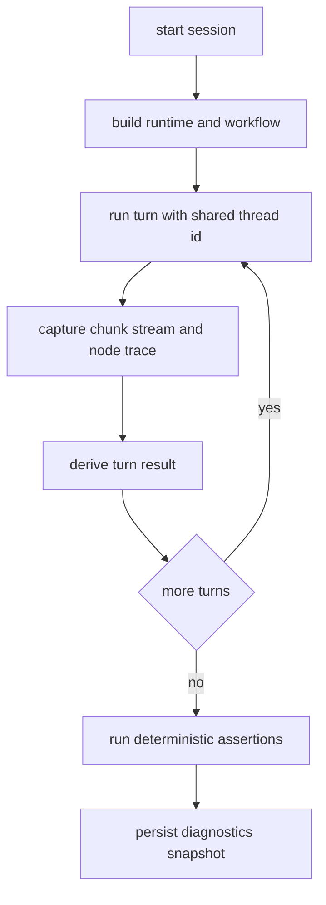

# Iterative State: Multi-turn API Test Harness for NLQ Conversations

## Scope Guard
This document now tracks the implementation subtask for iterative automated API testing of multi-turn Chainlit-like conversations.

In-scope files implemented/updated:
- `tests/integration/helpers/__init__.py`
- `tests/integration/helpers/conversation_driver.py`
- `tests/integration/helpers/assertions.py`
- `tests/integration/test_multi_turn_user_stories.py`
- `tests/integration/snapshots/test_user_stories_in_one_thread/it-thread-stable-user-stories.json`
- `docs/ITERATIVE_API_TEST_HARNESS_STATE.md`

Out-of-scope for this subtask:
- Unrelated production refactors
- Non-integration test-suite redesign

---

## Assumptions

### A1. Runtime behavioral contract from current flow
1. Session continuity is anchored by `thread_id` passed in graph config and persisted via `MemorySaver` checkpointer.
2. Conversation state accumulates through `AgentState.messages` reducer (`operator.add`) and graph loop (`agent -> tools -> agent`) until no further tool calls.
3. Language is inferred once when absent and then preserved via state (`router_node`).
4. A system prompt is injected once per conversation if missing.
5. Error in a tool call is converted to `ToolMessage(status=error)` through fallback and loop continues.

### A2. Integration baseline reality
1. Existing integration tests are currently single-turn service checks, not graph-level multi-turn flow checks.
2. Existing integration gate is env-based (`INTEGRATION_TESTS=1`) and expects live Tracardi availability.

### A3. Ambiguity handling and smallest safe assumptions
1. User directive states no mocking allowed, which conflicts with requested CI-stable mocking strategy. Smallest safe assumption: implementation will provide **dual-mode test design**:
   - real-only mode as default policy per user directive,
   - optional mock-enabled mode architecture retained in plan as fallback if policy changes.
2. Since no formal API response schema exists for graph chunks, deterministic assertions should target stable invariants (node traversal, tool names, message role ordering, presence of key semantic markers) rather than full free-text equivalence.
3. Identity consistency is interpreted as stable `profile_id` and `thread_id` continuity across turns in a single session.

### A4. Implementation-phase assumptions added during coding
1. Importing `build_runtime_dependencies` from `src/app.py` in test helpers risks coupling tests to Chainlit startup concerns; smallest safe assumption applied: compose equivalent runtime directly from `create_default_bound_model()` + `tools` + `AGENT_PROMPT_VERSION`.
2. For CI-stable snapshots, deterministic snapshot filenames are preferable; smallest safe assumption applied: stable `thread_id` is injected by tests for deterministic snapshot pathing.
3. One true end-to-end path is retained as env-gated (`INTEGRATION_TESTS=1`) while default CI-safe path uses deterministic test tools/model.

---

## Completed Steps
- Implemented reusable conversation harness in `tests/integration/helpers/conversation_driver.py` with per-turn chunk capture and snapshot persistence.
- Implemented deterministic invariant assertions in `tests/integration/helpers/assertions.py` (protocol, identity continuity, expected tools, error recovery, turn indexing).
- Added multi-turn story tests in `tests/integration/test_multi_turn_user_stories.py` covering multilingual switching, follow-up context, tool-heavy flow, recovery after tool failure, and identity consistency.
- Added deterministic diagnostics artifact at `tests/integration/snapshots/test_user_stories_in_one_thread/it-thread-stable-user-stories.json`.
- Preserved one true end-to-end path under `INTEGRATION_TESTS=1` in `TestTrueEndToEndPath`.
- Executed targeted and integration-subset test commands and logged outcomes.

---

## Pending Steps
1. Optional: run env-enabled real E2E path (`INTEGRATION_TESTS=1`) in an environment with live credentials/services.
2. Optional: expand snapshot coverage to additional stories if future regression depth is needed.

---

## Implementation Plan

### 1) Reusable Conversation-Driver Helper API

Planned test helper module:
- `tests/integration/helpers/conversation_driver.py`

Proposed interfaces:

```python
@dataclass
class TurnSpec:
    user_text: str
    expect_tools: list[str] | None = None
    expect_language: str | None = None
    expect_error_recovery: bool = False
    notes: str | None = None

@dataclass
class TurnResult:
    turn_index: int
    user_text: str
    final_answer: str | None
    tool_calls: list[dict]
    node_trace: list[str]
    language: str | None
    profile_id: str | None
    thread_id: str | None
    raw_chunks: list[dict]

class ConversationDriver:
    async def start_session(self, *, thread_id: str | None = None, profile_id: str | None = None) -> None: ...
    async def run_turn(self, spec: TurnSpec) -> TurnResult: ...
    async def run_conversation(self, specs: list[TurnSpec]) -> list[TurnResult]: ...
    def persist_snapshot(self, test_name: str, results: list[TurnResult]) -> str: ...
```

Design notes:
- Driver composes runtime similarly to app startup: `build_runtime_dependencies` + `compile_workflow(checkpointer=MemorySaver, bound_tools=...)`.
- Driver uses one persistent `thread_id` config across turns to enforce memory continuity.
- Driver captures node emissions from `workflow.astream(...)` exactly as emitted, preserving observability for diagnostics.

### 2) Deterministic Per-turn Assertions and Diagnostics

Planned assertion helpers:
- `tests/integration/helpers/assertions.py`

Deterministic assertion layers:
1. **Protocol invariants**
   - each turn yields at least one `agent` output
   - tool turn includes `tools` node output when tool requested
   - terminal answer is non-empty or explicit fallback message
2. **State invariants**
   - `thread_id` unchanged across turns
   - `profile_id` unchanged across turns
   - detected language stable unless explicit language switch trigger in user text
3. **Semantic invariants**
   - expected tool name subset appears in tool call sequence
   - expected key phrase markers in final answer (normalized text)

Snapshot strategy:
- Store structured JSON snapshots per test under:
  - `tests/integration/snapshots/<test_name>/<timestamp_or_build_id>.json`
- Snapshot fields include:
  - turn metadata
  - node trace
  - tool call args and names
  - normalized final answer
  - exception/fallback markers
- Add redaction for secrets/tokens and unstable IDs.

### 3) CI-Stable Strategy

#### 3.1 Real-only policy track (user directive)
- Keep integration suite opt-in with strict environment contract:
  - `INTEGRATION_TESTS=1`
  - live Tracardi credentials and endpoint
  - live LLM provider credentials
- Stabilize without mocks via:
  - deterministic temperature 0 model settings
  - bounded assertion granularity (invariants, not exact prose)
  - retries for transient network/tool failures where contract allows
  - fixture pre-flight checks and early skip with explicit reason
  - curated deterministic test prompts reducing semantic variability

#### 3.2 Optional fallback architecture track (if policy changes)
- Design placeholders for selective mocking boundaries:
  - mock external transport while preserving graph loop behavior
  - keep one true E2E path always enabled
- Not activated under current directive.

### 4) User-story Coverage Matrix

| Story ID | Scenario | Turn Pattern | Core Assertions | Data/Infra Requirements |
|---|---|---|---|---|
| US-ML-01 | Multilingual switching | EN -> FR -> NL follow-ups | language detection/transition + valid answer each turn | Live LLM supports multilingual prompts |
| US-FU-02 | Follow-up reference resolution | turn2 references entities from turn1 | prior context reused, no re-seeding needed | stable thread memory |
| US-TH-03 | Tool-heavy sequence | search -> segment -> push workflow | expected tool sequence appears, success responses | live Tracardi + Flexmail/Resend availability as configured |
| US-ER-04 | Recovery after induced tool failure | deliberate bad args then corrected retry | error ToolMessage observed then successful recovery | controllable failure prompt pattern |
| US-ID-05 | Identity consistency | multi-turn same session identity | profile_id/thread_id stable across all turns | stable profile provisioning endpoint |

### 5) Planned Test File Structure

- `tests/integration/test_conversation_harness.py`
  - harness-level behavior and helper smoke tests
- `tests/integration/test_multi_turn_user_stories.py`
  - matrix-driven tests for US-ML-01..US-ID-05
- `tests/integration/helpers/conversation_driver.py`
- `tests/integration/helpers/assertions.py`
- `tests/integration/snapshots/` (artifacts)

### 6) Workflow Diagram



---

## Test Command and Result Log Template

### Command Template

```bash
INTEGRATION_TESTS=1 pytest tests/integration/test_multi_turn_user_stories.py -m integration -v
```

### Result Log Template

| Date UTC | Command | Env Summary | Outcome | Key Failures | Snapshot Path |
|---|---|---|---|---|---|
| YYYY-MM-DDTHH:MM:SSZ | `...` | model=..., tracardi=..., flags=... | pass/fail/skip | short note | `tests/integration/snapshots/...` |

## Test Command and Result Log (Executed)

| Date UTC | Command | Env Summary | Outcome | Key Failures | Snapshot Path |
|---|---|---|---|---|---|
| 2026-02-21T14:13:27Z | `pytest tests/integration/test_multi_turn_user_stories.py -q` | shell-only, no poetry venv | fail | `pytest: command not found` | n/a |
| 2026-02-21T14:13:33Z | `poetry run pytest tests/integration/test_multi_turn_user_stories.py -q` | deterministic harness path; `INTEGRATION_TESTS` unset | fail | turn 6 expected tools mismatch, then fixed in test model dispatch order | n/a |
| 2026-02-21T14:13:52Z | `poetry run pytest tests/integration/test_multi_turn_user_stories.py -q` | deterministic harness path; `INTEGRATION_TESTS` unset | pass (`2 passed, 1 skipped`) | none | `tests/integration/snapshots/test_user_stories_in_one_thread/it-thread-stable-user-stories.json` |
| 2026-02-21T14:13:58Z | `poetry run pytest tests/integration -m integration -q` | integration subset; real-service tests env-gated | pass (`2 passed, 5 skipped`) | none | existing + stable story snapshot |
| 2026-02-21T14:14:35Z | `poetry run pytest tests/integration -m integration -q` | rerun after deterministic snapshot stabilization | pass (`2 passed, 5 skipped`) | none | `tests/integration/snapshots/test_user_stories_in_one_thread/it-thread-stable-user-stories.json` |

---

## Handoff Notes
- This document is the single source of iterative planning state for the API harness effort.
- If contract ambiguity emerges during implementation, append smallest safe assumption under Assumptions before coding.
