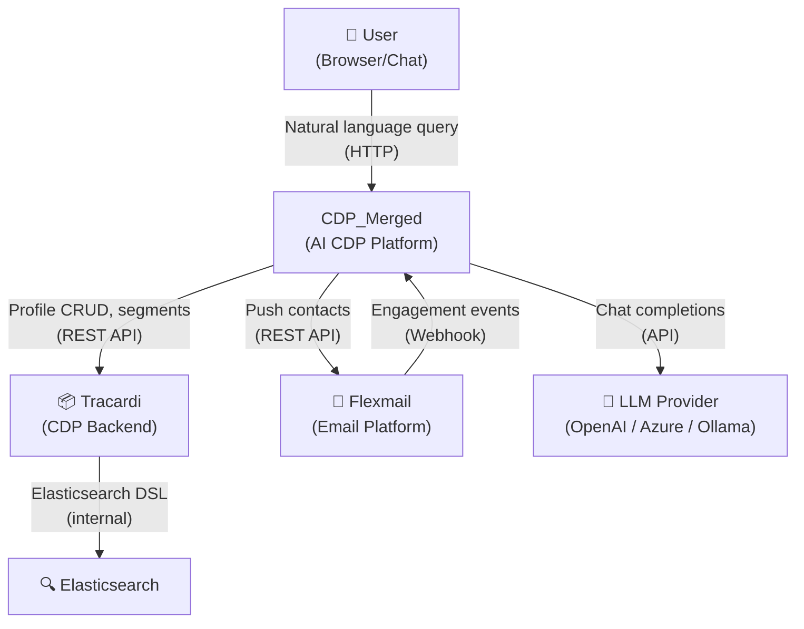
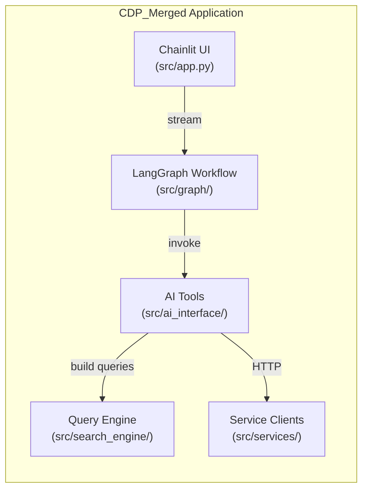
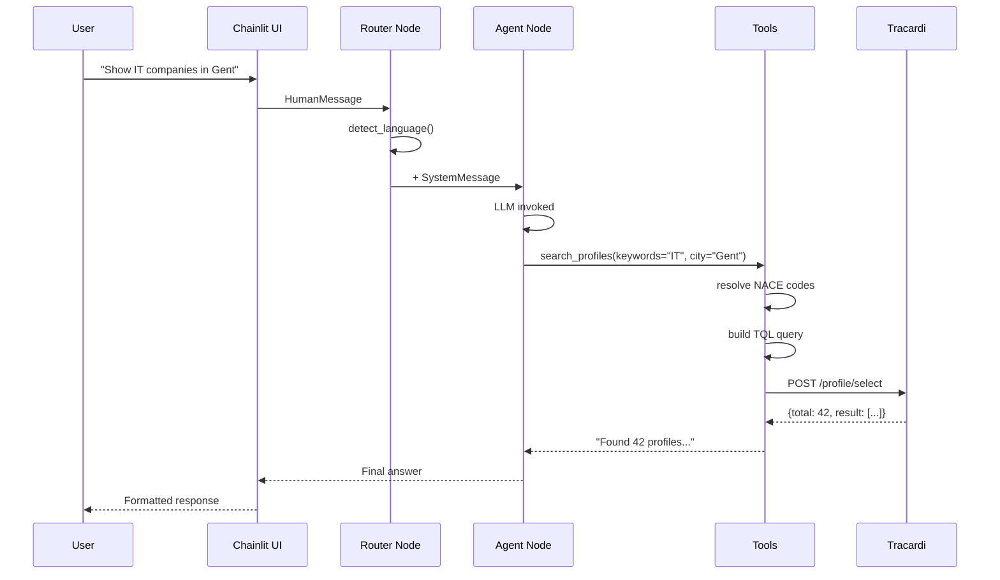

# Architecture — CDP_Merged

## System Context (C4 Level 1)

## Container Diagram (C4 Level 2)

## Data Flow — Natural Language Query

## Component Map

| Component | File(s) | Responsibility |
|---|---|---|
| Chainlit UI | `src/app.py` | Chat interface, session management |
| Router Node | `src/graph/nodes.py` | Language detection, system prompt injection |
| Agent Node | `src/graph/nodes.py` | LLM invocation with bound tools |
| Tool Node | `src/graph/workflow.py` | LangGraph tool execution with AgentState TQL storage |
| search_profiles | `src/ai_interface/tools/search.py` | NL→TQL→Tracardi with word boundary validation |
| create_segment | `src/ai_interface/tools/search.py` | Profile tagging using state-captured TQL |
| push_to_flexmail | `src/ai_interface/tools/email.py` | Segment sync to Flexmail |
| NACEResolver | `src/ai_interface/tools/nace_resolver.py` | Industry keyword → NACE codes (733 codes) |
| TQLBuilder | `src/search_engine/builders/tql_builder.py` | Tracardi Query Language (supports nace_code/nace_codes) |
| SQLBuilder | `src/search_engine/builders/sql_builder.py` | SQL reference queries (parameterized) |
| ESBuilder | `src/search_engine/builders/es_builder.py` | Elasticsearch DSL |
| TracardiClient | `src/services/tracardi.py` | Tracardi REST API |
| FlexmailClient | `src/services/flexmail.py` | Flexmail REST API |
| B2BProvider | `src/enrichment/b2b_provider.py` | Stub for Cognism/Lusha integration |

## Key Design Decisions

### AgentState-Based TQL Storage for Segment Alignment
To ensure consistency between search counts and segment creation, the system captures the exact TQL query used for search in `AgentState.last_tql_condition`. When creating a segment from search results, this stored TQL is used instead of reconstructing the query, eliminating mismatches caused by field name variations (e.g., `nace_code` vs `nace_codes`).

### Word Boundary Validation for Search Quality
To prevent false positives from substring matching (e.g., "Spitaels" matching "pita"), a validation layer applies regex word boundary checks (`\bkeyword\b`) when using lexical fallback search strategies. This ensures only true matches are returned while maintaining NACE code-based search as the primary method.

### NACE Code Resolution System
Industry keywords are resolved to NACE codes through a multi-layer resolution system:
1. **Domain synonyms** map common terms to NACE codes (e.g., "pita" → 56101-56290)
2. **Prefix filtering** narrows valid codes by industry sector
3. **733 codes** provide comprehensive coverage of Belgian business activities

### Strategy Pattern for Query Building
The `QueryFactory` → `QueryBuilder` pattern allows adding new query dialects
(e.g., MongoDB, BigQuery) without touching existing code.

### LangGraph State Machine
A simple 3-node graph (Router → Agent → Tools → Agent) keeps latency low
while supporting multi-turn tool use. The router injects the system prompt once
per session rather than on every message.

### Multi-LLM Abstraction
`BaseLLMProvider` decouples business logic from LLM vendors. The `MockProvider`
enables testing without API keys.

### KBO Data Model
KBO enterprise data is imported as Tracardi profiles. The key trait fields are:
- `traits.name` — company name
- `traits.city` — municipality
- `traits.status` — AC (active) / other
- `traits.nace_code` / `traits.nace_codes` — primary NACE activity (both variants supported)
- `traits.juridical_code` / `traits.juridical_codes` — Belgian legal form codes
- `traits.enterprise_number` — KBO number
- `traits.email`, `traits.phone` — contact info

### SQL Injection Prevention
The SQL builder supports parameterized queries via `build_parametrized()` which separates query structure from user input, preventing SQL injection attacks. The deprecated `build()` method is retained for backward compatibility but should not be used with user-provided input.
