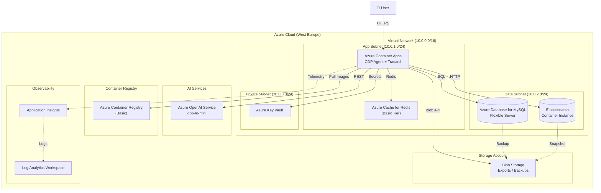
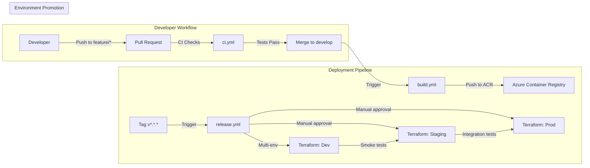
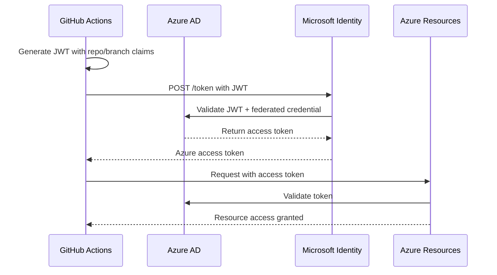
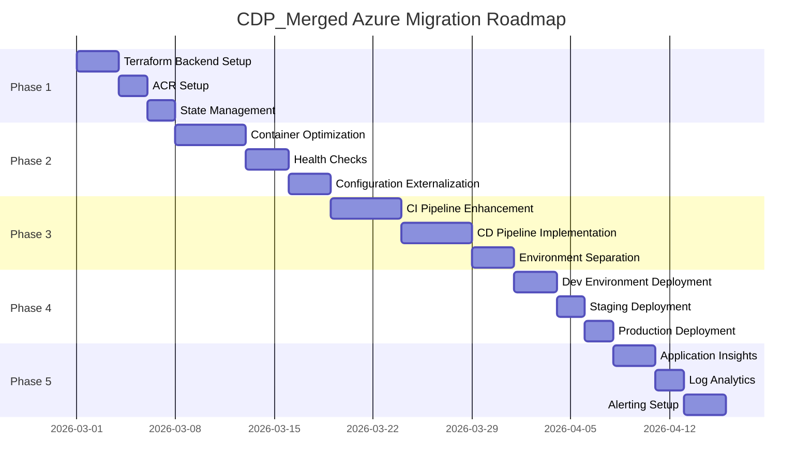

# Azure Deployment Strategy Report
## CDP_Merged - AI-Powered Customer Data Platform

**Document Version:** 1.0  
**Date:** 2026-02-21  
**Target Environment:** Azure Cloud (SaaS MVP)  
**Budget Constraint:** ~75 EUR/month

---

## Executive Summary

CDP_Merged is an AI-powered Customer Data Platform combining Chainlit UI, LangGraph workflows, Tracardi CDP (Elasticsearch-based), and Flexmail integration. This report provides a comprehensive deployment strategy for Azure, optimized for a 75 EUR/month MVP budget.

**Key Recommendations:**
- **Container Platform:** Azure Container Apps (serverless, cost-effective)
- **Database:** Azure Database for MySQL (Flexible Server) + Azure Blob for exports
- **Search:** Self-managed Elasticsearch on Container Apps (vs Azure Cognitive Search for cost)
- **LLM:** Azure OpenAI Service (pay-per-use, no infrastructure cost)
- **CI/CD:** GitHub Actions with OIDC federation (no secrets in repo)

**Estimated Monthly Cost:** €65-75

---

## Table of Contents

1. [Azure Architecture Design](#1-azure-architecture-design)
2. [Terraform IaC Specification](#2-terraform-iac-specification)
3. [GitHub Actions CI/CD Pipeline](#3-github-actions-cicd-pipeline)
4. [Azure Service Connection Setup](#4-azure-service-connection-setup)
5. [Migration Roadmap](#5-migration-roadmap)
6. [Project Backlog Integration](#6-project-backlog-integration)
7. [Risk Assessment](#7-risk-assessment)
8. [Next Steps](#8-next-steps)

---

## 1. Azure Architecture Design

### 1.1 High-Level Architecture



### 1.2 Container Strategy: Azure Container Apps (ACA)

**Decision:** Azure Container Apps over AKS or ACI

| Criteria | ACA | AKS | ACI |
|----------|-----|-----|-----|
| **Cost** | ✅ Low (pay-per-use) | ❌ High (node management) | ⚠️ Medium (no scaling) |
| **Scaling** | ✅ Built-in KEDA | ✅ HPA | ❌ Manual |
| **Complexity** | ✅ Low | ❌ High | ✅ Low |
| **Tracardi Support** | ✅ Yes | ✅ Yes | ⚠️ Limited |
| **Startup Time** | ✅ Fast | ✅ Always on | ✅ Fast |

**ACA Configuration:**
- **Environment:** Single managed environment
- **Workloads:**
  - `cdp-agent`: Chainlit UI + LangGraph (0.5 vCPU, 1GiB)
  - `tracardi-api`: Tracardi API server (0.5 vCPU, 1GiB)
  - `tracardi-gui`: Tracardi web UI (0.25 vCPU, 0.5GiB)
  - `elasticsearch`: Search engine (0.5 vCPU, 2GiB, single-node)

**Resource Allocation:**
```yaml
# ACA Resource Profile (per container)
cdp-agent:
  minReplicas: 0      # Scale to zero when idle
  maxReplicas: 2
  resources:
    cpu: 0.5
    memory: 1Gi

tracardi-api:
  minReplicas: 1      # Always on for API
  maxReplicas: 3
  resources:
    cpu: 0.5
    memory: 1Gi

elasticsearch:
  minReplicas: 1      # Data persistence required
  maxReplicas: 1
  resources:
    cpu: 0.5
    memory: 2Gi
```

**Cost Estimate:** ~€25-30/month (with scale-to-zero for UI)

### 1.3 Database Strategy

#### MySQL: Azure Database for MySQL - Flexible Server

**Decision:** Flexible Server (Burstable SKU) over Single Server

| Feature | Burstable B1ms | General Purpose |
|---------|---------------|-----------------|
| **vCores** | 1 (burstable) | 2 |
| **Memory** | 2 GiB | 8 GiB |
| **Storage** | 20 GiB | 32 GiB |
| **Cost/Month** | ~€10 | ~€45 |
| **Fit** | ✅ MVP/Testing | Production |

**Configuration:**
```hcl
# Terraform: MySQL Flexible Server
resource "azurerm_mysql_flexible_server" "tracardi" {
  name                   = "${var.project_name}-mysql-${var.environment}"
  resource_group_name    = azurerm_resource_group.main.name
  location               = azurerm_resource_group.main.location
  
  sku_name               = "B_Standard_B1ms"  # Burstable for cost
  storage_mb             = 20480                # 20 GB
  version                = "8.0"
  
  backup_retention_days  = 7
  geo_redundant_backup_enabled = false
  
  # Private access within VNet
  delegated_subnet_id    = azurerm_subnet.database.id
  private_dns_zone_id    = azurerm_private_dns_zone.mysql.id
}
```

#### Elasticsearch: Self-Managed on Container Apps

**Decision:** Self-managed over Azure Cognitive Search

| Option | Pros | Cons | Cost |
|--------|------|------|------|
| **Self-managed** | Full Tracardi compatibility, no API changes | Maintenance overhead | ~€15/month |
| **Azure Cognitive Search** | Fully managed, scalable | Requires Tracardi code changes, different API | ~€60/month |

**Elasticsearch Configuration:**
```yaml
# ACA Container for Elasticsearch
elasticsearch:
  image: docker.elastic.co/elasticsearch/elasticsearch:8.11.0
  environment:
    - discovery.type=single-node
    - xpack.security.enabled=false
    - "ES_JAVA_OPTS=-Xms1g -Xmx1g"
  resources:
    cpu: 0.5
    memory: 2Gi
  volumeMounts:
    - name: es-data
      mountPath: /usr/share/elasticsearch/data
```

### 1.4 Storage Strategy

**Azure Blob Storage (Standard LRS)**

| Use Case | Container | Lifecycle Policy |
|----------|-----------|------------------|
| KBO Data Exports | `exports` | Delete after 30 days |
| Elasticsearch Snapshots | `es-backups` | Archive after 7 days |
| Application Logs | `logs` | Delete after 90 days |
| Static Assets | `assets` | Keep indefinitely |

```hcl
# Terraform: Storage Account
resource "azurerm_storage_account" "main" {
  name                     = "${var.project_name}stg${var.environment}"
  resource_group_name      = azurerm_resource_group.main.name
  location                 = azurerm_resource_group.main.location
  account_tier             = "Standard"
  account_replication_type = "LRS"  # Cost-optimized
  
  blob_properties {
    versioning_enabled = false  # Save costs for MVP
    delete_retention_policy {
      days = 7
    }
  }
}
```

**Cost Estimate:** ~€2-5/month (low volume for MVP)

### 1.5 Networking Strategy

**Virtual Network Design:**

```
VNet: 10.0.0.0/16 (65,536 addresses)
├── Subnet-App:      10.0.1.0/24 (Container Apps)
├── Subnet-Data:     10.0.2.0/24 (MySQL, Private Endpoints)
├── Subnet-Private:  10.0.3.0/24 (Key Vault, other services)
└── Subnet-Gateway:  10.0.4.0/24 (Future: App Gateway)
```

**Security Approach:**
- **Private Endpoints:** For Key Vault, MySQL (no public access)
- **Service Endpoints:** For Storage Account
- **NSG Rules:** Deny inbound by default, allow 443/80 only
- **No VPN Gateway:** Cost saving (€150+/month) - use Azure Bastion for admin if needed

### 1.6 LLM Strategy: Azure OpenAI Service

**Configuration:**
- **Model:** GPT-4o-mini (cost-effective for MVP)
- **Deployment:** Pay-as-you-go (no provisioned throughput)
- **Region:** West Europe (lower latency for EU users)

**Cost Estimate:** €5-15/month (varies by usage)

```hcl
# Terraform: Azure OpenAI
resource "azurerm_cognitive_account" "openai" {
  name                = "${var.project_name}-openai-${var.environment}"
  location            = "westeurope"
  resource_group_name = azurerm_resource_group.main.name
  kind                = "OpenAI"
  sku_name            = "S0"  # Standard pay-as-you-go
  
  network_acls {
    default_action = "Deny"
    ip_rules       = [azurerm_container_app_environment.main.static_ip_address]
  }
}

resource "azurerm_cognitive_deployment" "gpt4o" {
  name                 = "gpt-4o-mini"
  cognitive_account_id = azurerm_cognitive_account.openai.id
  
  model {
    format  = "OpenAI"
    name    = "gpt-4o-mini"
    version = "2024-07-18"
  }
  
  sku {
    name     = "Standard"
    capacity = 1  # Low capacity for MVP
  }
}
```

### 1.7 Cost Summary

| Service | SKU/Config | Monthly Cost |
|---------|------------|--------------|
| Azure Container Apps | 1.75 vCPU, 4.5 GB (avg) | €25-30 |
| Azure Database for MySQL | B1ms Burstable | €10 |
| Azure Blob Storage | Standard LRS, 50 GB | €2-3 |
| Azure Cache for Redis | Basic C0 | €15 |
| Azure OpenAI | GPT-4o-mini, low usage | €5-10 |
| Azure Container Registry | Basic | €5 |
| Key Vault | Standard | €0.03 |
| Application Insights | Pay-as-you-go | €2-5 |
| **Total** | | **€64-78** |

---

## 2. Terraform IaC Specification

### 2.1 Module Structure

```
infra/
├── modules/
│   ├── networking/         # VNet, subnets, NSGs
│   ├── container_apps/     # ACA environment and apps
│   ├── database/           # MySQL Flexible Server
│   ├── storage/            # Blob storage
│   ├── security/           # Key Vault, managed identities
│   ├── monitoring/         # App Insights, Log Analytics
│   └── openai/             # Azure OpenAI Service
├── environments/
│   ├── dev/
│   │   ├── main.tf
│   │   ├── variables.tf
│   │   └── terraform.tfvars
│   ├── staging/
│   └── prod/
├── backend.tf              # Remote state configuration
└── variables.tf            # Global variables
```

### 2.2 Terraform Backend Configuration

```hcl
# infra/backend.tf
terraform {
  required_version = ">= 1.5.0"
  
  required_providers {
    azurerm = {
      source  = "hashicorp/azurerm"
      version = "~> 3.75"
    }
    random = {
      source  = "hashicorp/random"
      version = "~> 3.5"
    }
  }
  
  # Backend configured per-environment via init
  backend "azurerm" {
    resource_group_name  = "tfstate-rg"
    storage_account_name = "tfstatestgcdp"
    container_name       = "tfstate"
    key                  = "dev.terraform.tfstate"
    use_oidc             = true  # OIDC auth for GitHub Actions
  }
}

provider "azurerm" {
  features {
    resource_group {
      prevent_deletion_if_contains_resources = false
    }
  }
  use_oidc = true
}
```

### 2.3 Networking Module

```hcl
# infra/modules/networking/main.tf
resource "azurerm_virtual_network" "main" {
  name                = "${var.project_name}-vnet-${var.environment}"
  address_space       = ["10.0.0.0/16"]
  location            = var.location
  resource_group_name = var.resource_group_name
}

resource "azurerm_subnet" "app" {
  name                 = "snet-app"
  resource_group_name  = var.resource_group_name
  virtual_network_name = azurerm_virtual_network.main.name
  address_prefixes     = ["10.0.1.0/24"]
  
  delegation {
    name = "containerapps"
    service_delegation {
      name    = "Microsoft.App/environments"
      actions = ["Microsoft.Network/virtualNetworks/subnets/action"]
    }
  }
}

resource "azurerm_subnet" "database" {
  name                 = "snet-database"
  resource_group_name  = var.resource_group_name
  virtual_network_name = azurerm_virtual_network.main.name
  address_prefixes     = ["10.0.2.0/24"]
  service_endpoints    = ["Microsoft.Storage"]
}

resource "azurerm_subnet" "private" {
  name                 = "snet-private"
  resource_group_name  = var.resource_group_name
  virtual_network_name = azurerm_virtual_network.main.name
  address_prefixes     = ["10.0.3.0/24"]
}

resource "azurerm_network_security_group" "app" {
  name                = "${var.project_name}-app-nsg-${var.environment}"
  location            = var.location
  resource_group_name = var.resource_group_name
  
  security_rule {
    name                       = "AllowHTTPS"
    priority                   = 100
    direction                  = "Inbound"
    access                     = "Allow"
    protocol                   = "Tcp"
    source_port_range          = "*"
    destination_port_range     = "443"
    source_address_prefix      = "Internet"
    destination_address_prefix = "*"
  }
  
  security_rule {
    name                       = "DenyAllInbound"
    priority                   = 4096
    direction                  = "Inbound"
    access                     = "Deny"
    protocol                   = "*"
    source_port_range          = "*"
    destination_port_range     = "*"
    source_address_prefix      = "*"
    destination_address_prefix = "*"
  }
}
```

### 2.4 Container Apps Module

```hcl
# infra/modules/container_apps/main.tf
resource "azurerm_container_app_environment" "main" {
  name                       = "${var.project_name}-env-${var.environment}"
  location                   = var.location
  resource_group_name        = var.resource_group_name
  infrastructure_subnet_id   = var.app_subnet_id
  
  workload_profile {
    name                  = "Consumption"
    workload_profile_type = "Consumption"
  }
  
  internal_load_balancer_enabled = false  # Public access for MVP
}

# CDP Agent Application
resource "azurerm_container_app" "cdp_agent" {
  name                         = "cdp-agent"
  container_app_environment_id = azurerm_container_app_environment.main.id
  resource_group_name          = var.resource_group_name
  revision_mode                = "Single"
  
  identity {
    type = "SystemAssigned"
  }
  
  ingress {
    external_enabled = true
    target_port      = 8000
    transport        = "auto"
    
    traffic_weight {
      latest_revision = true
      percentage      = 100
    }
  }
  
  template {
    min_replicas = var.environment == "prod" ? 1 : 0
    max_replicas = var.environment == "prod" ? 3 : 2
    
    container {
      name   = "cdp-agent"
      image  = "${var.acr_login_server}/cdp-agent:${var.image_tag}"
      cpu    = 0.5
      memory = "1Gi"
      
      env {
        name  = "LLM_PROVIDER"
        value = "azure_openai"
      }
      
      env {
        name  = "TRACARDI_API_URL"
        value = "http://tracardi-api:80"
      }
      
      env {
        name        = "AZURE_OPENAI_API_KEY"
        secret_name = "azure-openai-key"
      }
      
      env {
        name  = "AZURE_OPENAI_ENDPOINT"
        value = var.openai_endpoint
      }
      
      env {
        name  = "LOG_LEVEL"
        value = var.environment == "prod" ? "INFO" : "DEBUG"
      }
    }
  }
}

# Tracardi API Application
resource "azurerm_container_app" "tracardi_api" {
  name                         = "tracardi-api"
  container_app_environment_id = azurerm_container_app_environment.main.id
  resource_group_name          = var.resource_group_name
  revision_mode                = "Single"
  
  ingress {
    external_enabled = false  # Internal only
    target_port      = 80
    transport        = "auto"
  }
  
  template {
    min_replicas = 1
    max_replicas = 3
    
    container {
      name   = "tracardi-api"
      image  = "tracardi/tracardi-api:1.0.0"
      cpu    = 0.5
      memory = "1Gi"
      
      env {
        name  = "ELASTIC_HOST"
        value = "elasticsearch"
      }
      
      env {
        name  = "MYSQL_HOST"
        value = var.mysql_host
      }
      
      env {
        name        = "MYSQL_PASSWORD"
        secret_name = "mysql-password"
      }
    }
  }
}

# Elasticsearch Container
resource "azurerm_container_app" "elasticsearch" {
  name                         = "elasticsearch"
  container_app_environment_id = azurerm_container_app_environment.main.id
  resource_group_name          = var.resource_group_name
  revision_mode                = "Single"
  
  ingress {
    external_enabled = false
    target_port      = 9200
    transport        = "tcp"
  }
  
  template {
    min_replicas = 1
    max_replicas = 1  # Single node for MVP
    
    container {
      name   = "elasticsearch"
      image  = "docker.elastic.co/elasticsearch/elasticsearch:8.11.0"
      cpu    = 0.5
      memory = "2Gi"
      
      env {
        name  = "discovery.type"
        value = "single-node"
      }
      
      env {
        name  = "xpack.security.enabled"
        value = "false"
      }
      
      env {
        name  = "ES_JAVA_OPTS"
        value = "-Xms1g -Xmx1g"
      }
      
      volume_mounts {
        name = "es-data"
        path = "/usr/share/elasticsearch/data"
      }
    }
    
    volume {
      name         = "es-data"
      storage_type = "AzureFile"
      storage_name = azurerm_container_app_environment_storage.es_data.name
    }
  }
}
```

### 2.5 Database Module

```hcl
# infra/modules/database/main.tf
resource "azurerm_mysql_flexible_server" "main" {
  name                   = "${var.project_name}-mysql-${var.environment}"
  resource_group_name    = var.resource_group_name
  location               = var.location
  
  administrator_login    = var.mysql_admin_username
  administrator_password = var.mysql_admin_password
  
  sku_name               = var.environment == "prod" ? "GP_Standard_D2ds_v4" : "B_Standard_B1ms"
  storage_mb             = var.environment == "prod" ? 32768 : 20480
  version                = "8.0"
  
  backup_retention_days        = var.environment == "prod" ? 35 : 7
  geo_redundant_backup_enabled = var.environment == "prod"
  
  delegated_subnet_id = var.subnet_id
  private_dns_zone_id = azurerm_private_dns_zone.mysql.id
  
  lifecycle {
    prevent_destroy = true
  }
}

resource "azurerm_mysql_flexible_database" "tracardi" {
  name                = "tracardi"
  resource_group_name = var.resource_group_name
  server_name         = azurerm_mysql_flexible_server.main.name
  charset             = "utf8mb4"
  collation           = "utf8mb4_unicode_ci"
}

resource "azurerm_mysql_flexible_server_firewall_rule" "allow_aca" {
  name                = "allow-aca-subnet"
  resource_group_name = var.resource_group_name
  server_name         = azurerm_mysql_flexible_server.main.name
  start_ip_address    = cidrhost(var.app_subnet_cidr, 1)
  end_ip_address      = cidrhost(var.app_subnet_cidr, 254)
}
```

### 2.6 Security Module (Key Vault)

```hcl
# infra/modules/security/main.tf
resource "azurerm_key_vault" "main" {
  name                       = "${var.project_name}-kv-${var.environment}"
  location                   = var.location
  resource_group_name        = var.resource_group_name
  tenant_id                  = data.azurerm_client_config.current.tenant_id
  sku_name                   = "standard"
  soft_delete_retention_days = 7
  purge_protection_enabled   = false  # Allow deletion for MVP
  
  network_acls {
    default_action             = "Deny"
    bypass                     = "AzureServices"
    virtual_network_subnet_ids = [var.app_subnet_id]
  }
}

# Store secrets
resource "azurerm_key_vault_secret" "mysql_password" {
  name         = "mysql-admin-password"
  value        = var.mysql_admin_password
  key_vault_id = azurerm_key_vault.main.id
}

resource "azurerm_key_vault_secret" "openai_key" {
  name         = "azure-openai-key"
  value        = var.openai_api_key
  key_vault_id = azurerm_key_vault.main.id
}

resource "azurerm_key_vault_secret" "flexmail_token" {
  name         = "flexmail-api-token"
  value        = var.flexmail_api_token
  key_vault_id = azurerm_key_vault.main.id
}

# Access policy for ACA managed identity
resource "azurerm_key_vault_access_policy" "cdp_agent" {
  key_vault_id = azurerm_key_vault.main.id
  tenant_id    = data.azurerm_client_config.current.tenant_id
  object_id    = var.cdp_agent_principal_id
  
  secret_permissions = ["Get", "List"]
}
```

### 2.7 Environment Variables (terraform.tfvars)

```hcl
# infra/environments/dev/terraform.tfvars
project_name = "cdpmerged"
environment  = "dev"
location     = "westeurope"

# Container Images
image_tag = "latest"

# Database (Burstable for cost savings)
mysql_sku_name   = "B_Standard_B1ms"
mysql_storage_mb = 20480

# Feature flags
enable_geo_redundant_backup = false
enable_auto_scaling         = false
```

```hcl
# infra/environments/prod/terraform.tfvars
project_name = "cdpmerged"
environment  = "prod"
location     = "westeurope"

# Container Images
image_tag = "stable"

# Database (General Purpose for production)
mysql_sku_name   = "GP_Standard_D2ds_v4"
mysql_storage_mb = 65536

# Feature flags
enable_geo_redundant_backup = true
enable_auto_scaling         = true
```

---

## 3. GitHub Actions CI/CD Pipeline

### 3.1 Workflow Architecture



### 3.2 CI Workflow (ci.yml)

```yaml
# .github/workflows/ci.yml
name: CI

on:
  push:
    branches: [main, develop]
  pull_request:
    branches: [main, develop]

env:
  PYTHON_VERSION: "3.12"
  POETRY_VERSION: "1.7.1"

jobs:
  lint:
    name: Lint & Type Check
    runs-on: ubuntu-latest
    steps:
      - uses: actions/checkout@v4

      - name: Set up Python
        uses: actions/setup-python@v5
        with:
          python-version: ${{ env.PYTHON_VERSION }}

      - name: Install Poetry
        uses: snok/install-poetry@v1
        with:
          version: ${{ env.POETRY_VERSION }}
          virtualenvs-create: true
          virtualenvs-in-project: true

      - name: Cache dependencies
        uses: actions/cache@v4
        with:
          path: .venv
          key: ${{ runner.os }}-poetry-${{ hashFiles('pyproject.toml', 'poetry.lock') }}

      - name: Install dependencies
        run: poetry install --no-interaction

      - name: Run ruff linter
        run: poetry run ruff check src/ tests/

      - name: Run ruff formatter check
        run: poetry run ruff format --check src/ tests/

      - name: Run mypy type checker
        run: poetry run mypy src/ --ignore-missing-imports

  test:
    name: Unit Tests
    runs-on: ubuntu-latest
    needs: lint
    strategy:
      matrix:
        python-version: ["3.11", "3.12"]
    steps:
      - uses: actions/checkout@v4

      - name: Set up Python ${{ matrix.python-version }}
        uses: actions/setup-python@v5
        with:
          python-version: ${{ matrix.python-version }}

      - name: Install Poetry
        uses: snok/install-poetry@v1
        with:
          version: ${{ env.POETRY_VERSION }}
          virtualenvs-create: true
          virtualenvs-in-project: true

      - name: Cache dependencies
        uses: actions/cache@v4
        with:
          path: .venv
          key: ${{ runner.os }}-py${{ matrix.python-version }}-poetry-${{ hashFiles('pyproject.toml') }}

      - name: Install dependencies
        run: poetry install --no-interaction

      - name: Run tests with coverage
        env:
          LLM_PROVIDER: mock
          OPENAI_API_KEY: test-key
          TRACARDI_API_URL: http://localhost:8686
          FLEXMAIL_ENABLED: "false"
        run: |
          poetry run pytest tests/ \
            -m "not integration and not e2e" \
            --cov=src \
            --cov-report=xml \
            --cov-report=term-missing \
            -v

      - name: Upload coverage
        uses: codecov/codecov-action@v4
        with:
          file: ./coverage.xml
          flags: unittests
        if: matrix.python-version == '3.12'

  build-docker:
    name: Build Docker Image
    runs-on: ubuntu-latest
    needs: test
    if: github.event_name == 'push'
    steps:
      - uses: actions/checkout@v4

      - name: Set up Docker Buildx
        uses: docker/setup-buildx-action@v3

      - name: Build image (no push)
        uses: docker/build-push-action@v5
        with:
          context: .
          push: false
          tags: cdp-agent:test
          cache-from: type=gha
          cache-to: type=gha,mode=max
```

### 3.3 Build & Push Workflow (build.yml)

```yaml
# .github/workflows/build.yml
name: Build and Push

on:
  push:
    branches: [main, develop]
  workflow_dispatch:

env:
  REGISTRY: ${{ secrets.AZURE_CONTAINER_REGISTRY }}.azurecr.io
  IMAGE_NAME: cdp-agent

jobs:
  build-and-push:
    name: Build & Push to ACR
    runs-on: ubuntu-latest
    permissions:
      id-token: write
      contents: read
    
    steps:
      - uses: actions/checkout@v4

      # OIDC Login to Azure
      - name: Azure Login
        uses: azure/login@v1
        with:
          client-id: ${{ secrets.AZURE_CLIENT_ID }}
          tenant-id: ${{ secrets.AZURE_TENANT_ID }}
          subscription-id: ${{ secrets.AZURE_SUBSCRIPTION_ID }}

      # Login to ACR
      - name: Login to ACR
        run: |
          az acr login --name ${{ secrets.AZURE_CONTAINER_REGISTRY }}

      # Docker Buildx for multi-platform builds
      - name: Set up Docker Buildx
        uses: docker/setup-buildx-action@v3

      # Extract metadata
      - name: Extract metadata
        id: meta
        uses: docker/metadata-action@v5
        with:
          images: ${{ env.REGISTRY }}/${{ env.IMAGE_NAME }}
          tags: |
            type=ref,event=branch
            type=sha,prefix=sha-
            type=raw,value=latest,enable={{is_default_branch}}

      # Build and push
      - name: Build and push
        uses: docker/build-push-action@v5
        with:
          context: .
          push: true
          tags: ${{ steps.meta.outputs.tags }}
          labels: ${{ steps.meta.outputs.labels }}
          cache-from: type=gha
          cache-to: type=gha,mode=max
          platforms: linux/amd64

      # Update image tag in Terraform vars
      - name: Update Terraform vars
        run: |
          SHORT_SHA=$(echo ${{ github.sha }} | cut -c1-7)
          echo "image_tag=sha-$SHORT_SHA" >> $GITHUB_ENV
```

### 3.4 Terraform Deploy Workflow (terraform-deploy.yml)

```yaml
# .github/workflows/terraform-deploy.yml
name: Terraform Deploy

on:
  push:
    branches: [main]
    paths:
      - 'infra/**'
  workflow_dispatch:
    inputs:
      environment:
        description: 'Environment to deploy'
        required: true
        default: 'dev'
        type: choice
        options:
          - dev
          - staging
          - prod

env:
  TF_VERSION: "1.6.0"

jobs:
  terraform-plan:
    name: Terraform Plan
    runs-on: ubuntu-latest
    permissions:
      id-token: write
      contents: read
      pull-requests: write
    environment:
      name: ${{ github.event.inputs.environment || 'dev' }}
    
    steps:
      - uses: actions/checkout@v4

      - name: Azure Login
        uses: azure/login@v1
        with:
          client-id: ${{ secrets.AZURE_CLIENT_ID }}
          tenant-id: ${{ secrets.AZURE_TENANT_ID }}
          subscription-id: ${{ secrets.AZURE_SUBSCRIPTION_ID }}

      - name: Setup Terraform
        uses: hashicorp/setup-terraform@v3
        with:
          terraform_version: ${{ env.TF_VERSION }}

      - name: Terraform Init
        working-directory: infra/environments/${{ github.event.inputs.environment || 'dev' }}
        run: |
          terraform init \
            -backend-config="resource_group_name=${{ secrets.TFSTATE_RG }}" \
            -backend-config="storage_account_name=${{ secrets.TFSTATE_STORAGE }}" \
            -backend-config="container_name=tfstate" \
            -backend-config="key=${{ github.event.inputs.environment || 'dev' }}.terraform.tfstate"

      - name: Terraform Plan
        working-directory: infra/environments/${{ github.event.inputs.environment || 'dev' }}
        run: |
          terraform plan \
            -var="image_tag=${{ github.sha }}" \
            -var="mysql_admin_password=${{ secrets.MYSQL_ADMIN_PASSWORD }}" \
            -var="openai_api_key=${{ secrets.AZURE_OPENAI_KEY }}" \
            -out=tfplan

      - name: Upload Plan
        uses: actions/upload-artifact@v4
        with:
          name: tfplan
          path: infra/environments/${{ github.event.inputs.environment || 'dev' }}/tfplan

  terraform-apply:
    name: Terraform Apply
    runs-on: ubuntu-latest
    needs: terraform-plan
    if: github.ref == 'refs/heads/main'
    permissions:
      id-token: write
      contents: read
    environment:
      name: ${{ github.event.inputs.environment || 'dev' }}
      url: ${{ steps.deploy.outputs.app_url }}
    
    steps:
      - uses: actions/checkout@v4

      - name: Azure Login
        uses: azure/login@v1
        with:
          client-id: ${{ secrets.AZURE_CLIENT_ID }}
          tenant-id: ${{ secrets.AZURE_TENANT_ID }}
          subscription-id: ${{ secrets.AZURE_SUBSCRIPTION_ID }}

      - name: Setup Terraform
        uses: hashicorp/setup-terraform@v3
        with:
          terraform_version: ${{ env.TF_VERSION }}

      - name: Download Plan
        uses: actions/download-artifact@v4
        with:
          name: tfplan
          path: infra/environments/${{ github.event.inputs.environment || 'dev' }}

      - name: Terraform Init
        working-directory: infra/environments/${{ github.event.inputs.environment || 'dev' }}
        run: |
          terraform init \
            -backend-config="resource_group_name=${{ secrets.TFSTATE_RG }}" \
            -backend-config="storage_account_name=${{ secrets.TFSTATE_STORAGE }}"

      - name: Terraform Apply
        working-directory: infra/environments/${{ github.event.inputs.environment || 'dev' }}
        run: terraform apply -auto-approve tfplan

      - name: Output App URL
        id: deploy
        working-directory: infra/environments/${{ github.event.inputs.environment || 'dev' }}
        run: |
          echo "app_url=$(terraform output -raw app_url)" >> $GITHUB_OUTPUT
```

### 3.5 Release Workflow (release.yml)

```yaml
# .github/workflows/release.yml
name: Release

on:
  push:
    tags:
      - 'v*.*.*'

env:
  REGISTRY: ${{ secrets.AZURE_CONTAINER_REGISTRY }}.azurecr.io

jobs:
  release:
    name: Build, Push & Deploy
    runs-on: ubuntu-latest
    permissions:
      id-token: write
      contents: write
      packages: write
    
    steps:
      - uses: actions/checkout@v4

      - name: Azure Login
        uses: azure/login@v1
        with:
          client-id: ${{ secrets.AZURE_CLIENT_ID }}
          tenant-id: ${{ secrets.AZURE_TENANT_ID }}
          subscription-id: ${{ secrets.AZURE_SUBSCRIPTION_ID }}

      - name: Login to ACR
        run: az acr login --name ${{ secrets.AZURE_CONTAINER_REGISTRY }}

      - name: Set up Docker Buildx
        uses: docker/setup-buildx-action@v3

      - name: Extract version
        id: version
        run: echo "VERSION=${GITHUB_REF#refs/tags/v}" >> $GITHUB_OUTPUT

      - name: Build and push release image
        uses: docker/build-push-action@v5
        with:
          context: .
          push: true
          tags: |
            ${{ env.REGISTRY }}/cdp-agent:${{ steps.version.outputs.VERSION }}
            ${{ env.REGISTRY }}/cdp-agent:stable
          cache-from: type=gha
          cache-to: type=gha,mode=max

      - name: Setup Terraform
        uses: hashicorp/setup-terraform@v3
        with:
          terraform_version: "1.6.0"

      # Deploy to Staging
      - name: Deploy to Staging
        working-directory: infra/environments/staging
        run: |
          terraform init -backend-config="resource_group_name=${{ secrets.TFSTATE_RG }}"
          terraform apply -auto-approve \
            -var="image_tag=${{ steps.version.outputs.VERSION }}" \
            -var="mysql_admin_password=${{ secrets.MYSQL_ADMIN_PASSWORD_STAGING }}"

      # Deploy to Production (manual approval required via GitHub Environment)
      - name: Deploy to Production
        working-directory: infra/environments/prod
        run: |
          terraform init -backend-config="resource_group_name=${{ secrets.TFSTATE_RG }}"
          terraform apply -auto-approve \
            -var="image_tag=${{ steps.version.outputs.VERSION }}" \
            -var="mysql_admin_password=${{ secrets.MYSQL_ADMIN_PASSWORD_PROD }}"

      - name: Create GitHub Release
        uses: softprops/action-gh-release@v1
        with:
          generate_release_notes: true
```

### 3.6 Secret Management

**GitHub Secrets Required:**

| Secret | Description | Source |
|--------|-------------|--------|
| `AZURE_CLIENT_ID` | Service Principal App ID | Azure AD App Registration |
| `AZURE_TENANT_ID` | Azure AD Tenant ID | Azure Portal |
| `AZURE_SUBSCRIPTION_ID` | Azure Subscription ID | Azure Portal |
| `AZURE_CONTAINER_REGISTRY` | ACR name | Azure Portal |
| `TFSTATE_RG` | Terraform state resource group | Manual setup |
| `TFSTATE_STORAGE` | Terraform state storage account | Manual setup |
| `MYSQL_ADMIN_PASSWORD` | MySQL admin password | Azure Key Vault |
| `AZURE_OPENAI_KEY` | Azure OpenAI API key | Azure Portal |
| `FLEXMAIL_API_TOKEN` | Flexmail API token | Flexmail Dashboard |

**Secret Rotation Strategy:**
1. **Azure OpenAI Key:** Rotated quarterly via Azure Key Vault
2. **MySQL Password:** Rotated manually, requires app restart
3. **Service Principal:** Use federated credentials (no secret expiration)

---

## 4. Azure Service Connection Setup

### 4.1 Architecture: OIDC Federation



### 4.2 Step-by-Step Setup

#### Step 1: Create Azure AD Application Registration

```bash
# Login to Azure
az login

# Set subscription
az account set --subscription "Your-Subscription-Name"

# Create App Registration
APP_NAME="cdp-merged-github-actions"
SUBSCRIPTION_ID=$(az account show --query id -o tsv)

# Create the app
APP_ID=$(az ad app create \
  --display-name "$APP_NAME" \
  --query appId -o tsv)

echo "App ID: $APP_ID"
```

#### Step 2: Create Federated Credentials (OIDC)

```bash
# Federated credential for main branch
az ad app federated-credential create \
  --id "$APP_ID" \
  --parameters "{
    \"name\": \"github-main-branch\",
    \"issuer\": \"https://token.actions.githubusercontent.com\",
    \"subject\": \"repo:your-org/CDP_Merged:ref:refs/heads/main\",
    \"description\": \"GitHub Actions - Main Branch\",
    \"audiences\": [\"api://AzureADTokenExchange\"]
  }"

# Federated credential for environment deployments
az ad app federated-credential create \
  --id "$APP_ID" \
  --parameters "{
    \"name\": \"github-production-env\",
    \"issuer\": \"https://token.actions.githubusercontent.com\",
    \"subject\": \"repo:your-org/CDP_Merged:environment:production\",
    \"description\": \"GitHub Actions - Production Environment\",
    \"audiences\": [\"api://AzureADTokenExchange\"]
  }"

# Federated credential for pull requests (read-only)
az ad app federated-credential create \
  --id "$APP_ID" \
  --parameters "{
    \"name\": \"github-pull-requests\",
    \"issuer\": \"https://token.actions.githubusercontent.com\",
    \"subject\": \"repo:your-org/CDP_Merged:pull_request\",
    \"description\": \"GitHub Actions - PR Validation\",
    \"audiences\": [\"api://AzureADTokenExchange\"]
  }"
```

#### Step 3: Create Service Principal and Assign Roles

```bash
# Create Service Principal
SP_OBJECT_ID=$(az ad sp create --id "$APP_ID" --query id -o tsv)

# Assign minimal RBAC roles

# 1. Container Registry Push/Pull
az role assignment create \
  --assignee "$APP_ID" \
  --role "AcrPush" \
  --scope "/subscriptions/$SUBSCRIPTION_ID/resourceGroups/cdp-merged-rg"

# 2. Terraform State Storage (read/write)
az role assignment create \
  --assignee "$APP_ID" \
  --role "Storage Blob Data Contributor" \
  --scope "/subscriptions/$SUBSCRIPTION_ID/resourceGroups/tfstate-rg"

# 3. Key Vault Secrets Officer (for reading secrets)
az role assignment create \
  --assignee "$APP_ID" \
  --role "Key Vault Secrets Officer" \
  --scope "/subscriptions/$SUBSCRIPTION_ID/resourceGroups/cdp-merged-rg"

# 4. Custom role for Container Apps (limited permissions)
cat > container-apps-deployer.json << 'EOF'
{
  "Name": "Container Apps Deployer",
  "Description": "Deploy and manage Container Apps",
  "Actions": [
    "Microsoft.App/containerApps/read",
    "Microsoft.App/containerApps/write",
    "Microsoft.App/containerApps/delete",
    "Microsoft.App/managedEnvironments/read",
    "Microsoft.App/managedEnvironments/write"
  ],
  "NotActions": [],
  "DataActions": [],
  "NotDataActions": []
}
EOF

az role definition create --role-definition @container-apps-deployer.json

az role assignment create \
  --assignee "$APP_ID" \
  --role "Container Apps Deployer" \
  --scope "/subscriptions/$SUBSCRIPTION_ID/resourceGroups/cdp-merged-rg"
```

#### Step 4: Configure GitHub Secrets

```bash
# Get required values
TENANT_ID=$(az account show --query tenantId -o tsv)
echo "TENANT_ID: $TENANT_ID"
echo "SUBSCRIPTION_ID: $SUBSCRIPTION_ID"
echo "CLIENT_ID (App ID): $APP_ID"
```

Navigate to GitHub Repository → Settings → Secrets and Variables → Actions:

| Secret Name | Value |
|-------------|-------|
| `AZURE_CLIENT_ID` | `$APP_ID` |
| `AZURE_TENANT_ID` | `$TENANT_ID` |
| `AZURE_SUBSCRIPTION_ID` | `$SUBSCRIPTION_ID` |
| `AZURE_CONTAINER_REGISTRY` | `cdpmergedacr` |

#### Step 5: Verify Setup

```yaml
# Test workflow: .github/workflows/verify-azure.yml
name: Verify Azure Connection

on:
  workflow_dispatch:

permissions:
  id-token: write
  contents: read

jobs:
  verify:
    runs-on: ubuntu-latest
    steps:
      - uses: actions/checkout@v4
      
      - name: Azure Login
        uses: azure/login@v1
        with:
          client-id: ${{ secrets.AZURE_CLIENT_ID }}
          tenant-id: ${{ secrets.AZURE_TENANT_ID }}
          subscription-id: ${{ secrets.AZURE_SUBSCRIPTION_ID }}
      
      - name: Verify Access
        run: |
          az account show
          az group list --output table
          az acr list --output table
```

### 4.3 RBAC Permissions Summary

| Resource | Role | Scope | Justification |
|----------|------|-------|---------------|
| Container Registry | AcrPush | Resource Group | Push/pull images |
| Storage Account | Storage Blob Data Contributor | TF State RG | Terraform state management |
| Key Vault | Key Vault Secrets Officer | Resource Group | Read deployment secrets |
| Container Apps | Container Apps Deployer | Resource Group | Deploy and manage apps |
| Resource Group | Contributor | Resource Group | Create/manage resources |

**Security Best Practices:**
1. ✅ Use federated credentials (no secrets in GitHub)
2. ✅ Scope roles to resource group level (not subscription)
3. ✅ Separate environments with different service principals
4. ✅ Enable Conditional Access policies for production

---

## 5. Migration Roadmap

### 5.1 Phase Overview



### 5.2 Phase 1: Infrastructure Bootstrap (Week 1)

**Objective:** Establish foundational infrastructure for Terraform and container registry.

**Tasks:**

| Task | Description | Effort | Owner |
|------|-------------|--------|-------|
| 1.1 | Create resource group for Terraform state | 1h | DevOps |
| 1.2 | Create storage account for TF state (LRS, soft delete) | 1h | DevOps |
| 1.3 | Create Azure Container Registry (Basic tier) | 1h | DevOps |
| 1.4 | Configure Terraform backend configuration | 2h | DevOps |
| 1.5 | Create base networking module (VNet, subnets) | 4h | DevOps |
| 1.6 | Set up GitHub OIDC federation | 2h | DevOps |

**Deliverables:**
- Terraform state storage operational
- ACR accessible from GitHub Actions
- OIDC authentication working

**Validation:**
```bash
# Verify backend
cd infra/environments/dev
terraform init
terraform plan
```

### 5.3 Phase 2: Containerization Improvements (Week 2)

**Objective:** Optimize containers for Azure deployment.

**Tasks:**

| Task | Description | Effort | Owner |
|------|-------------|--------|-------|
| 2.1 | Add health check endpoint to app | 2h | Backend |
| 2.2 | Configure structured logging for Azure | 2h | Backend |
| 2.3 | Externalize configuration (Key Vault integration) | 4h | Backend |
| 2.4 | Optimize Docker image (multi-stage build) | 2h | DevOps |
| 2.5 | Create docker-compose.prod.yml for local testing | 2h | DevOps |
| 2.6 | Add startup/shutdown hooks for graceful handling | 2h | Backend |

**Code Changes Required:**

```python
# src/app.py - Add health check
@cl.get("/health")
async def health_check():
    """Health check endpoint for Azure Container Apps."""
    return {"status": "healthy", "version": "0.1.0"}
```

```dockerfile
# Dockerfile - Multi-stage optimization
FROM python:3.12-slim as builder

WORKDIR /app
RUN pip install poetry
COPY pyproject.toml poetry.lock ./
RUN poetry export -f requirements.txt --output requirements.txt --without-hashes

FROM python:3.12-slim

WORKDIR /app
COPY --from=builder /app/requirements.txt .
RUN pip install --no-cache-dir -r requirements.txt

COPY src ./src
EXPOSE 8000
HEALTHCHECK --interval=30s --timeout=10s --start-period=5s --retries=3 \
  CMD curl -f http://localhost:8000/health || exit 1

CMD ["chainlit", "run", "src/app.py", "--host", "0.0.0.0", "--port", "8000"]
```

### 5.4 Phase 3: CI/CD Pipeline Implementation (Week 3)

**Objective:** Implement automated build and deployment pipelines.

**Tasks:**

| Task | Description | Effort | Owner |
|------|-------------|--------|-------|
| 3.1 | Enhance CI workflow with Docker build | 2h | DevOps |
| 3.2 | Create build-and-push workflow | 3h | DevOps |
| 3.3 | Create Terraform deploy workflow | 4h | DevOps |
| 3.4 | Implement environment promotion strategy | 3h | DevOps |
| 3.5 | Add automated smoke tests post-deploy | 3h | QA |
| 3.6 | Configure GitHub environments with protection rules | 2h | DevOps |

**GitHub Environment Protection Rules:**

```yaml
# Configure in GitHub UI: Settings → Environments

Environment: production
- Required reviewers: 1 (team lead)
- Wait timer: 5 minutes
- Deployment branches: main only
- Required status checks: ci/tests
```

### 5.5 Phase 4: Production Deployment (Week 4)

**Objective:** Deploy to all environments with proper validation.

**Tasks:**

| Task | Description | Effort | Owner |
|------|-------------|--------|-------|
| 4.1 | Deploy to Dev environment | 4h | DevOps |
| 4.2 | Run smoke tests on Dev | 2h | QA |
| 4.3 | Deploy to Staging environment | 2h | DevOps |
| 4.4 | Run integration tests on Staging | 4h | QA |
| 4.5 | Deploy to Production (manual trigger) | 2h | DevOps |
| 4.6 | Production validation and monitoring | 2h | DevOps |

**Smoke Test Script:**

```bash
#!/bin/bash
# scripts/smoke-test.sh

set -e

APP_URL=$1

echo "Testing health endpoint..."
curl -sf "${APP_URL}/health" || exit 1

echo "Testing chat endpoint..."
curl -sf -X POST "${APP_URL}/chat" \
  -H "Content-Type: application/json" \
  -d '{"message":"Hello"}' || exit 1

echo "Smoke tests passed!"
```

### 5.6 Phase 5: Monitoring & Observability (Week 5)

**Objective:** Set up comprehensive monitoring and alerting.

**Tasks:**

| Task | Description | Effort | Owner |
|------|-------------|--------|-------|
| 5.1 | Create Log Analytics workspace | 1h | DevOps |
| 5.2 | Configure Application Insights | 2h | DevOps |
| 5.3 | Set up container logs forwarding | 2h | DevOps |
| 5.4 | Create custom metrics dashboard | 3h | DevOps |
| 5.5 | Configure alert rules | 3h | DevOps |
| 5.6 | Document runbooks | 4h | DevOps |

**Alert Rules:**

```hcl
# Terraform alert configuration
resource "azurerm_monitor_metric_alert" "high_error_rate" {
  name                = "high-error-rate"
  resource_group_name = var.resource_group_name
  scopes              = [azurerm_container_app.cdp_agent.id]
  description         = "Error rate exceeds threshold"
  
  criteria {
    metric_namespace = "Microsoft.App/containerApps"
    metric_name      = "Requests"
    aggregation      = "Count"
    operator         = "GreaterThan"
    threshold        = 10
    
    dimension {
      name     = "StatusCodeClass"
      operator = "Include"
      values   = ["5xx"]
    }
  }
  
  action {
    action_group_id = azurerm_monitor_action_team.id
  }
}
```

---

## 6. Project Backlog Integration

### 6.1 Backlog Items by Priority

#### 🔴 Critical (P0) - Must have before production

| ID | Task | Effort | Sprint |
|----|------|--------|--------|
| INFRA-001 | Set up Terraform backend (storage account) | 4h | Phase 1 |
| INFRA-002 | Create Azure Container Registry | 2h | Phase 1 |
| INFRA-003 | Configure GitHub OIDC federation | 4h | Phase 1 |
| INFRA-004 | Create base Terraform networking module | 8h | Phase 1 |
| APP-001 | Add `/health` endpoint for container health checks | 4h | Phase 2 |
| APP-002 | Configure application for Azure Key Vault secrets | 8h | Phase 2 |
| CI-001 | Create GitHub Actions build workflow | 8h | Phase 3 |
| CI-002 | Create GitHub Actions deployment workflow | 8h | Phase 3 |
| DEP-001 | Deploy to Azure Dev environment | 8h | Phase 4 |

#### 🟠 High (P1) - Required for stable operation

| ID | Task | Effort | Sprint |
|----|------|--------|--------|
| INFRA-005 | Create Terraform database module | 8h | Phase 1 |
| INFRA-006 | Create Terraform container apps module | 12h | Phase 1 |
| APP-003 | Optimize Docker image (multi-stage) | 4h | Phase 2 |
| APP-004 | Add structured logging for Azure Monitor | 6h | Phase 2 |
| CI-003 | Create environment-specific Terraform configs | 6h | Phase 3 |
| CI-004 | Implement automated smoke tests | 8h | Phase 3 |
| DEP-002 | Deploy to Azure Staging environment | 4h | Phase 4 |
| DEP-003 | Deploy to Azure Production environment | 4h | Phase 4 |
| MON-001 | Set up Application Insights | 4h | Phase 5 |
| MON-002 | Create Log Analytics workspace | 2h | Phase 5 |

#### 🟡 Medium (P2) - Important for maintainability

| ID | Task | Effort | Sprint |
|----|------|--------|--------|
| INFRA-007 | Create Terraform monitoring module | 6h | Phase 1 |
| INFRA-008 | Implement private endpoints for Key Vault | 6h | Phase 2 |
| APP-005 | Add graceful shutdown handling | 4h | Phase 2 |
| CI-005 | Configure GitHub environment protection rules | 4h | Phase 3 |
| CI-006 | Add Terraform plan preview in PR comments | 6h | Phase 3 |
| MON-003 | Create Azure Monitor dashboard | 6h | Phase 5 |
| MON-004 | Configure alert rules for critical metrics | 6h | Phase 5 |
| MON-005 | Document operational runbooks | 8h | Phase 5 |

#### 🟢 Low (P3) - Nice to have

| ID | Task | Effort | Sprint |
|----|------|--------|--------|
| INFRA-009 | Implement Azure Front Door for CDN | 8h | Future |
| INFRA-010 | Set up geo-redundant backups | 6h | Future |
| APP-006 | Implement distributed caching with Redis | 8h | Future |
| CI-007 | Add performance testing to pipeline | 12h | Future |
| MON-006 | Set up custom metrics and SLIs | 8h | Future |

### 6.2 Sprint Planning

**Sprint 1: Foundation (2 weeks)**
- INFRA-001 to INFRA-006
- Focus: Terraform modules and Azure infrastructure

**Sprint 2: Application Readiness (2 weeks)**
- APP-001 to APP-005
- Focus: Container optimization and Azure integration

**Sprint 3: Automation (2 weeks)**
- CI-001 to CI-006
- Focus: CI/CD pipeline implementation

**Sprint 4: Deployment (1 week)**
- DEP-001 to DEP-003
- Focus: Multi-environment deployment

**Sprint 5: Observability (1 week)**
- MON-001 to MON-005
- Focus: Monitoring and alerting

### 6.3 Effort Summary

| Category | Total Effort |
|----------|--------------|
| Infrastructure (Terraform) | ~40h |
| Application Changes | ~22h |
| CI/CD Pipeline | ~32h |
| Deployment | ~16h |
| Monitoring | ~22h |
| **Grand Total** | **~132h (~3.5 weeks)** |

---

## 7. Risk Assessment

### 7.1 Risk Matrix

| Risk | Likelihood | Impact | Mitigation |
|------|------------|--------|------------|
| **Tracardi compatibility with Azure MySQL** | Medium | High | Test thoroughly in dev; have rollback plan |
| **Elasticsearch data persistence on ACA** | Medium | High | Use Azure Files share; implement backup strategy |
| **Cost overrun (budget: €75/month)** | Low | Medium | Set up budget alerts; use scale-to-zero |
| **LLM latency with Azure OpenAI** | Low | Medium | Use GPT-4o-mini; implement caching |
| **GitHub Actions minutes exhaustion** | Low | Low | Monitor usage; optimize workflows |
| **Secrets exposure** | Low | Critical | Use OIDC; no secrets in code; rotate regularly |
| **Data loss during migration** | Low | Critical | Backups before migration; test restore |

### 7.2 Mitigation Strategies

**Risk: Elasticsearch Data Persistence**
```hcl
# Persistent storage for Elasticsearch
resource "azurerm_container_app_environment_storage" "es_data" {
  name                         = "es-data"
  container_app_environment_id = azurerm_container_app_environment.main.id
  account_name                 = azurerm_storage_account.main.name
  share_name                   = azurerm_storage_share.es_data.name
  access_key                   = azurerm_storage_account.main.primary_access_key
  access_mode                  = "ReadWrite"
}

# Daily backup job
resource "azurerm_container_app" "es_backup" {
  # Scheduled job for ES snapshots
  template {
    min_replicas = 0
    max_replicas = 1
  }
}
```

**Risk: Cost Control**
```hcl
# Budget alert
resource "azurerm_consumption_budget_resource_group" "monthly" {
  name              = "monthly-budget"
  resource_group_id = azurerm_resource_group.main.id
  
  amount     = 75
  time_grain = "Monthly"
  
  notification {
    enabled        = true
    threshold      = 80
    operator       = "GreaterThan"
    contact_emails = ["admin@example.com"]
  }
}
```

---

## 8. Next Steps

### 8.1 Immediate Actions (This Week)

1. **Review and approve this architecture document**
2. **Create Azure subscription** with budget alerts
3. **Set up Terraform backend** storage account
4. **Create Azure AD application** for GitHub Actions
5. **Initialize GitHub Secrets** with Azure credentials

### 8.2 For Coding Agent

The following tasks are ready for implementation:

**Priority 1: Terraform Modules**
```
infra/
├── modules/
│   ├── networking/      # VNet, subnets, NSGs
│   ├── container_apps/  # ACA environment + apps
│   ├── database/        # MySQL Flexible Server
│   ├── storage/         # Blob storage account
│   └── security/        # Key Vault
```

**Priority 2: GitHub Actions**
```
.github/workflows/
├── ci.yml              # Existing - needs enhancement
├── build.yml           # NEW: Build and push to ACR
├── terraform-plan.yml  # NEW: Plan on PR
└── terraform-deploy.yml # NEW: Deploy on merge
```

**Priority 3: Application Changes**
```python
# src/app.py
@cl.get("/health")
async def health_check():
    """Azure Container Apps health probe."""
    return {"status": "healthy"}

# src/config.py
# Add Azure Key Vault integration
class AzureKeyVaultSettings(BaseSettings):
    # Load secrets from Key Vault if AZURE_KEY_VAULT_NAME is set
    @classmethod
    def settings_customise_sources(cls, ...):
        # Implement Key Vault secret source
```

### 8.3 Required Decisions

| Decision | Options | Recommendation |
|----------|---------|----------------|
| Elasticsearch hosting | ACA vs ACI vs Azure Cognitive Search | ACA with persistent volume |
| MySQL tier | Burstable vs General Purpose | Start with Burstable (B1ms) |
| Redis | Azure Cache vs self-hosted | Azure Cache Basic C0 |
| Environment count | Dev/Prod vs Dev/Staging/Prod | Start with Dev/Prod |
| Backup retention | 7 vs 35 days | 7 days for MVP |

---

## Appendix A: Azure Service Tiers Comparison

### Container Platforms

| Service | Best For | Monthly Cost (MVP) | Scaling |
|---------|----------|-------------------|---------|
| Container Apps | Serverless apps, event-driven | €25-30 | KEDA (advanced) |
| ACI | Simple containers, batch jobs | €30-40 | Manual |
| AKS | Complex microservices | €100+ | HPA/VPA |

### Database Options

| Service | Best For | Monthly Cost | Notes |
|---------|----------|--------------|-------|
| MySQL Flexible (B1ms) | MVP, development | €10 | Burstable CPU |
| MySQL Flexible (D2ds) | Production workloads | €45 | Consistent performance |
| Cosmos DB | Global distribution | €80+ | Overkill for MVP |

### Search Options

| Service | Best For | Monthly Cost | Tracardi Compatible |
|---------|----------|--------------|---------------------|
| Self-hosted ES on ACA | Cost optimization | €15 | ✅ Yes |
| Azure Cognitive Search | Fully managed | €60 | ❌ Requires changes |
| Elasticsearch Cloud | Managed ES | €50+ | ✅ Yes |

---

## Appendix B: Cost Optimization Tips

1. **Use scale-to-zero for non-production**
   ```yaml
   minReplicas: 0  # Save costs when idle
   maxReplicas: 2
   ```

2. **Reserve capacity for predictable workloads**
   - 1-year reserved instance: ~40% savings
   - 3-year reserved instance: ~60% savings

3. **Use spot instances for dev/test**
   - Up to 90% discount
   - Acceptable eviction for non-production

4. **Monitor with Azure Advisor**
   - Automated cost recommendations
   - Right-sizing suggestions

5. **Tag resources for chargeback**
   ```hcl
   tags = {
     Environment = var.environment
     Project     = var.project_name
     CostCenter  = "engineering"
   }
   ```

---

## Document Control

| Version | Date | Author | Changes |
|---------|------|--------|---------|
| 1.0 | 2026-02-21 | Azure Architect | Initial release |

---

**Note:** This document is ready for review. Please provide feedback on architecture decisions, particularly:
1. Elasticsearch hosting approach (self-managed vs managed)
2. MySQL tier selection (Burstable B1ms for cost savings)
3. Container Apps vs alternative platforms
4. Environment strategy (Dev/Prod vs Dev/Staging/Prod)

Additional research areas welcome: Azure savings plans, Azure Front Door integration, multi-region considerations for future scaling.
