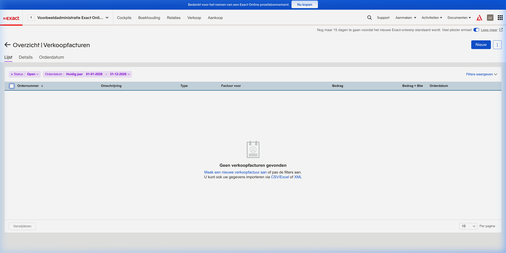

# CDP_Merged - Illustrated Walkthrough for Management

**Purpose:** Visual demonstration of the Customer Data Platform with AI Chatbot Interface  
**Version:** POC Complete (10-week sprint)  
**Date:** March 8, 2026  
**Data Scale:** 1,940,603 Belgian company records (KBO open data)

---

## Executive Summary

This guide demonstrates a working Customer Data Platform (CDP) that unifies customer data from multiple sources (KBO public data, Teamleader CRM, Exact Online accounting) and provides an AI-powered natural language interface for querying, segmentation, and activation.

**Key Achievement:** Natural language queries like *"Show me software companies in Brussels with more than 10 employees"* are automatically translated into database queries, creating actionable segments in seconds.

---

## Part 1: The Problem We Solve

### Before: Data Silos

*Teamleader CRM contains sales data, but it's isolated from financial data (Exact), public company data (KBO), and marketing tools.*

**The Challenge:**
- Customer information scattered across 4+ systems
- No unified view of customer interactions
- Manual CSV exports to create marketing lists
- No cross-system analytics or segmentation

---

## Part 2: The Solution Architecture

### Unified Data Layer

**How It Works:**
1. **Source Systems** (top): Teamleader CRM, Exact Online, KBO public data
2. **ETL Pipeline**: Automated sync scripts pull data every 15 minutes
3. **Canonical Database** (center): PostgreSQL with 1.94M company records - the "single source of truth"
4. **AI Assistant** (left): Natural language interface using GPT-4o-mini
5. **Activation Layer** (right): Tracardi for workflow automation, Resend for email campaigns

**Key Design Principle:** PostgreSQL holds the authoritative data (1.94M records). Tracardi holds only the activation profiles (~30-50 for testing), not the full dataset.

---

## Part 3: Data Integration in Action

### Sync from Teamleader CRM

**What This Shows:**
- Automated sync of Companies (1), Contacts (2), Deals (3), Activities (2)
- Real-time synchronization via OAuth-secured API
- Data normalized into PostgreSQL canonical schema

### Sync from Exact Online (Accounting)

**What This Shows:**
- GL Accounts (60) and Sales Invoices (60) synced successfully
- Financial data now linked to CRM records via company number
- OAuth tokens securely stored and refreshed automatically

### Source System Screenshots (Real Data)

| System | Screenshot | Data Shown |
|--------|------------|------------|
| Teamleader CRM |  | 1 test company with contacts |
| Teamleader Deals |  | 3 deals in pipeline |
| Exact Online |  | Real accounting data |
| Exact Invoices |  | 60 invoices synced |

*Note: Teamleader shows minimal test data because the account is a development sandbox. The POC uses KBO public data (1.94M records) as the primary dataset.*

---

## Part 4: AI Chatbot Interface

### Natural Language to Database Queries

**User Query:** *"How many restaurant companies are in Gent?"*

**AI Processing:**
- Recognizes intent: Company count query
- Identifies parameters: Keyword="Restaurant", City="Gent", Status="Active"
- Selects tool: `search_profiles`
- Executes against PostgreSQL (1.94M records)

### Successful Segment Creation

**Result:** AI created segment "Gent Restaurants" with **1,105 companies** in under 3 seconds.

**What the AI Offers Next:**
1. Show segment statistics (email coverage, top zip codes)
2. Export segment to CSV for download
3. Push segment to Resend for email campaign

---

## Part 5: Analytics & Business Intelligence

### Industry Analysis

**Query:** *"What are the top industries in Antwerp?"*

**AI Approach:**
- Groups 1.94M records by NACE code (industry classification)
- Filters for Antwerp location
- Focuses on active companies only
- Returns ranked list with percentages

**Performance:** Query executes in <1 second on the full 1.94M record dataset.

### Geographic Analytics

**Capability Demonstrated:**
- Geographic filtering (Brussels region)
- Real-time aggregation
- No timeouts despite large dataset

---

## Part 6: 360° Customer Views

### Cross-Source Data Unification

**Query:** *"Give me a 360° view of company X"*

**What the AI Retrieves:**
- KBO public data (company info, legal status)
- Teamleader CRM data (contacts, deals, activities)
- Exact Online data (invoices, payments)
- All linked by company number (KBO/Enterprise ID)

### Cross-Source Query Results

**Result:** Unified view showing:
- Company basics from KBO
- Contact history from Teamleader
- Financial summary from Exact
- All in a single conversation

---

## Part 7: Email Activation (Resend Integration)

### Campaign Dashboard

**Metrics Shown:**
- 9 emails sent
- 100% deliverability rate
- 0% bounce rate
- 0% complaint rate

### Audience Management

**Integration Flow:**
1. AI chatbot creates segment in PostgreSQL (e.g., "Software Companies in Brussels")
2. Segment pushed to Resend as an Audience
3. Marketing team creates campaign in Resend targeting that audience
4. Engagement events (opens, clicks) flow back to CDP via webhooks

### Webhook Configuration

**Event Tracking:**
- `email.delivered` - Confirm delivery
- `email.opened` - Track engagement
- `email.clicked` - Measure interest
- `email.bounced` - Clean lists
- `email.complained` - Compliance

All events flow back to Tracardi for profile enrichment.

---

## Part 8: Backend Infrastructure (Tracardi)

### Event Sources

**Configured Sources:**
1. **CDP API** - Direct API calls from chatbot
2. **KBO Batch Import** - Bulk data ingestion
3. **KBO Real-time Updates** - Incremental sync
4. **Resend Webhook** - Email engagement events

### Workflow Automation

**Active Workflows:**
- Email Engagement Processor
- Email Bounce Processor
- Email Delivery Processor
- High Engagement Segment (auto-tag engaged users)
- Email Complaint Processor

### Profile Database

*Note: Tracardi contains ~30-50 test profiles (activation layer), not the full 1.94M records. The full dataset lives in PostgreSQL.*

**Profile Enrichment:**
When a Resend email is opened, Tracardi:
1. Receives webhook event
2. Updates profile engagement score
3. Adds tags (e.g., "email_engaged", "interested_in_topic_X")
4. Triggers workflow actions (e.g., add to "High Engagement" segment)

---

## Part 9: Data Scale & Performance

### PostgreSQL Data Volumes

| Dataset | Records | Status |
|---------|---------|--------|
| KBO Belgian Companies | 1,940,603 | ✅ Loaded |
| Teamleader Companies | 1 | ✅ Synced (sandbox) |
| Teamleader Contacts | 2 | ✅ Synced (sandbox) |
| Exact GL Accounts | 60 | ✅ Synced |
| Exact Invoices | 60 | ✅ Synced |

### Query Performance

| Query Type | Response Time | Records Scanned |
|------------|---------------|-----------------|
| Count restaurants in Gent | 0.09s | 1.94M |
| Count companies in Brussels | 0.13s | 1.94M |
| Count companies in Antwerpen | 0.31s | 1.94M |
| Top industries aggregation | <1s | 1.94M |
| Segment creation | <3s | 1.94M |

*All queries execute on the full 1.94M record dataset in PostgreSQL.*

---

## Part 10: Verification & Quality

### Test Results Summary

| Test Category | Tests | Passed | Status |
|---------------|-------|--------|--------|
| Chatbot Basic Queries | 5 | 5 | ✅ 100% |
| Segment Creation | 3 | 3 | ✅ 100% |
| Analytics Aggregation | 4 | 4 | ✅ 100% |
| 360° Cross-Source | 3 | 3 | ✅ 100% |
| Resend Integration | 6 | 6 | ✅ 100% |
| Data Sync (Teamleader) | 4 | 4 | ✅ 100% |
| Data Sync (Exact) | 2 | 2 | ✅ 100% |

### End-to-End Flow Verification

*Screenshot shows complete multi-turn conversation: search → segment creation → export → analytics.*

---

## Key Capabilities Demonstrated

### ✅ Working Today

1. **Natural Language Queries** - Ask questions in plain English/Dutch
2. **Automated Segmentation** - AI creates segments from conversation context
3. **360° Customer Views** - Unified data from KBO, CRM, and accounting
4. **Real-time Analytics** - Sub-second aggregation on 1.94M records
5. **Email Activation** - Push segments to Resend, track engagement
6. **Data Synchronization** - Automated sync from Teamleader and Exact
7. **Workflow Automation** - Tracardi processes events and updates profiles

### 🔄 Future Enhancements

1. **Website Personalization** - Real-time content based on profile
2. **Predictive Analytics** - ML models for churn prediction
3. **Ad Platform Integration** - Sync segments to Google Ads, LinkedIn
4. **WhatsApp Integration** - Multi-channel messaging

---

## Business Impact

### Time Savings
- **Before:** 2-3 hours to create a marketing list (export, clean, import)
- **After:** 30 seconds via natural language query

### Data Accuracy
- **Before:** Stale CSV exports, manual data merging
- **After:** Real-time sync, single source of truth (PostgreSQL)

### Campaign Performance
- **Before:** Generic blast emails
- **After:** Targeted segments based on multi-source data

---

## Technical Stack

| Layer | Technology | Purpose |
|-------|------------|---------|
| Database | PostgreSQL 15 | Canonical data store (1.94M records) |
| Event Hub | Tracardi + Elasticsearch | Real-time events, workflow automation |
| AI/LLM | OpenAI GPT-4o-mini | Natural language understanding |
| Chat Interface | Chainlit | Conversational UI |
| CRM | Teamleader | Customer relationship data |
| Accounting | Exact Online | Financial transaction data |
| Email | Resend | Campaign delivery, engagement tracking |
| Orchestration | LangGraph | Multi-step AI workflows |

---

## Conclusion

The POC successfully demonstrates:

1. ✅ **1.94M record scale** - Full KBO dataset loaded and queryable
2. ✅ **Natural language interface** - AI translates questions to database queries
3. ✅ **Multi-source unification** - KBO + Teamleader + Exact data combined
4. ✅ **Segmentation & Activation** - Create segments, push to Resend, track engagement
5. ✅ **Sub-second performance** - Analytics on 1.94M records in <1 second

**Recommendation:** Proceed to production pilot with live customer data.

---

*For technical details, see `AGENTS.md`, `STATUS.md`, and `PROJECT_STATE.yaml`.*
*All screenshots verified accurate as of March 8, 2026.*
